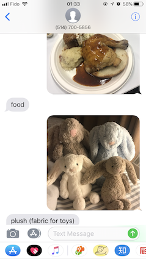
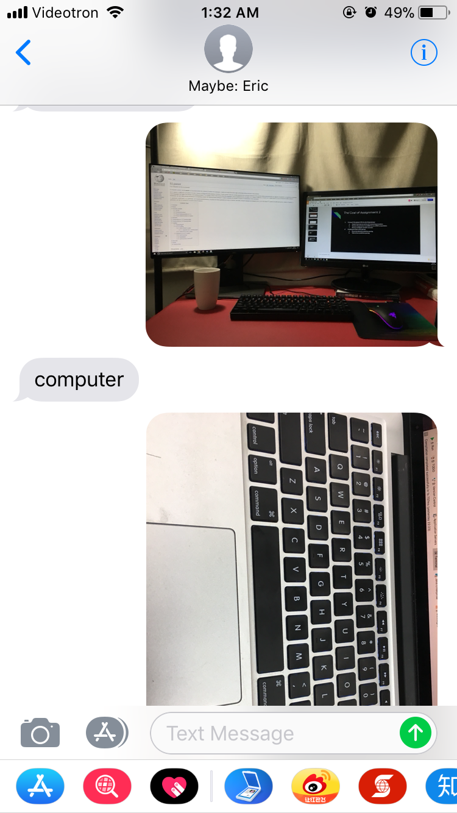
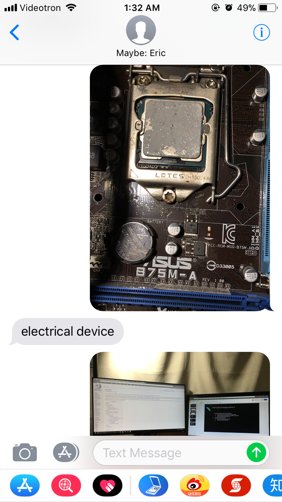
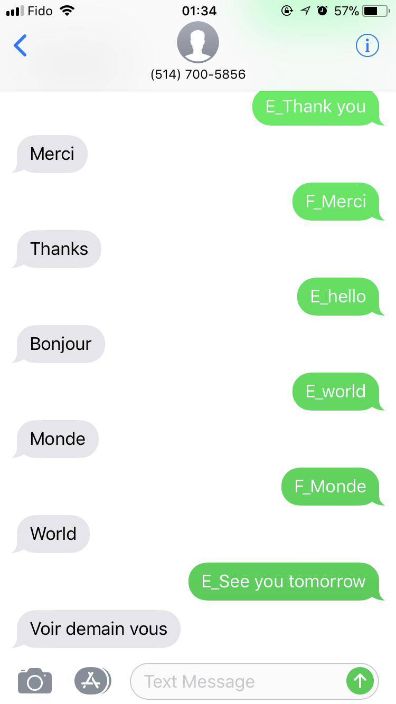

# UNiMe

We have designed and implemented a SMS automatic reply system through using **Twilio APIs** which have two major functions:

1. Using **IBM API** implement a image recognizing function.
2. Using **IBM API** achieve a translating function between English and French.

## Team Information

We are a three-member-team as listed below (the list follows the first character of the name's order in the alphabet):

- [Grey Lee](https://github.com/kidd-4)
- [Haotao Lai](http://laihaotao.me/about/)
- [Qi Xia](https://github.com/sakichat)

## Related Techniques

1. The major system is build through using **Twilio SMS APIs**, we have applied a number and it will reply customers automatically.
2. The functions are build by using **IBM APIs**:  
  2.1 If you send an image, the system will recognize what it is and give back the result through SMS.  
  2.2 The translating function, can achieve two-way translation, English and French. You can type "F_" before the text which you want to translate.

## Examples

1. Image Recognize  
  By sending image to our number (514-700-5856), you will receive the result from our system.  
  
  
  
  
  
2. Two-way Translation  
  By texting English or French (adding "F_" before French means translate French to English), you will receive the translation result from our system.  
  
  
